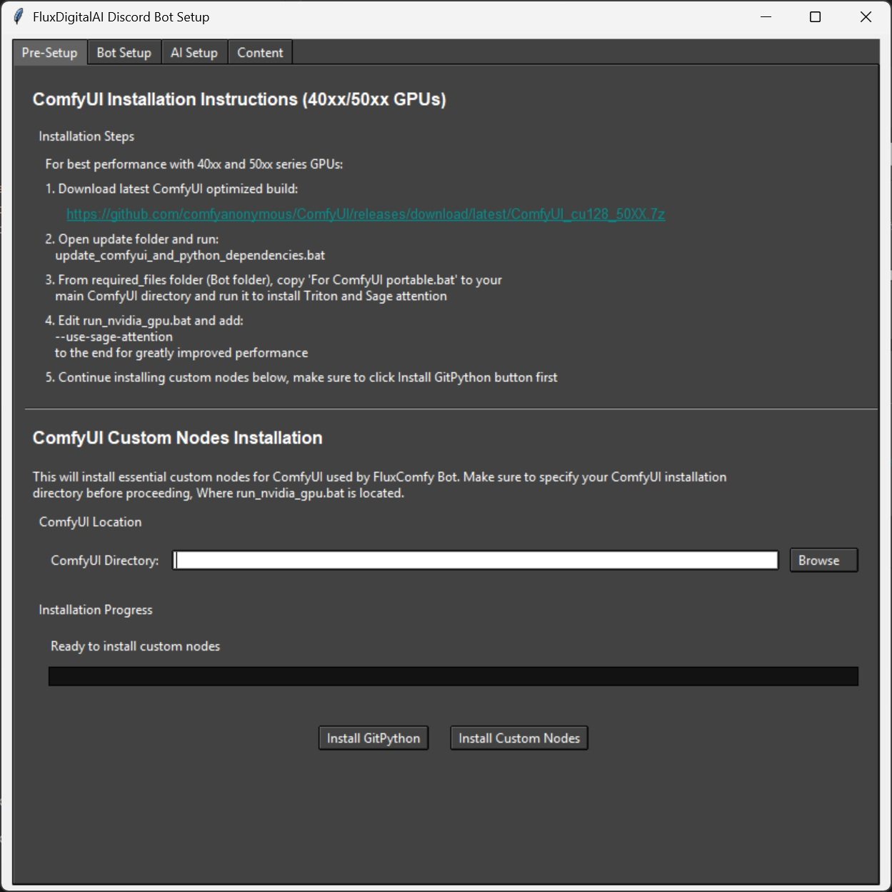
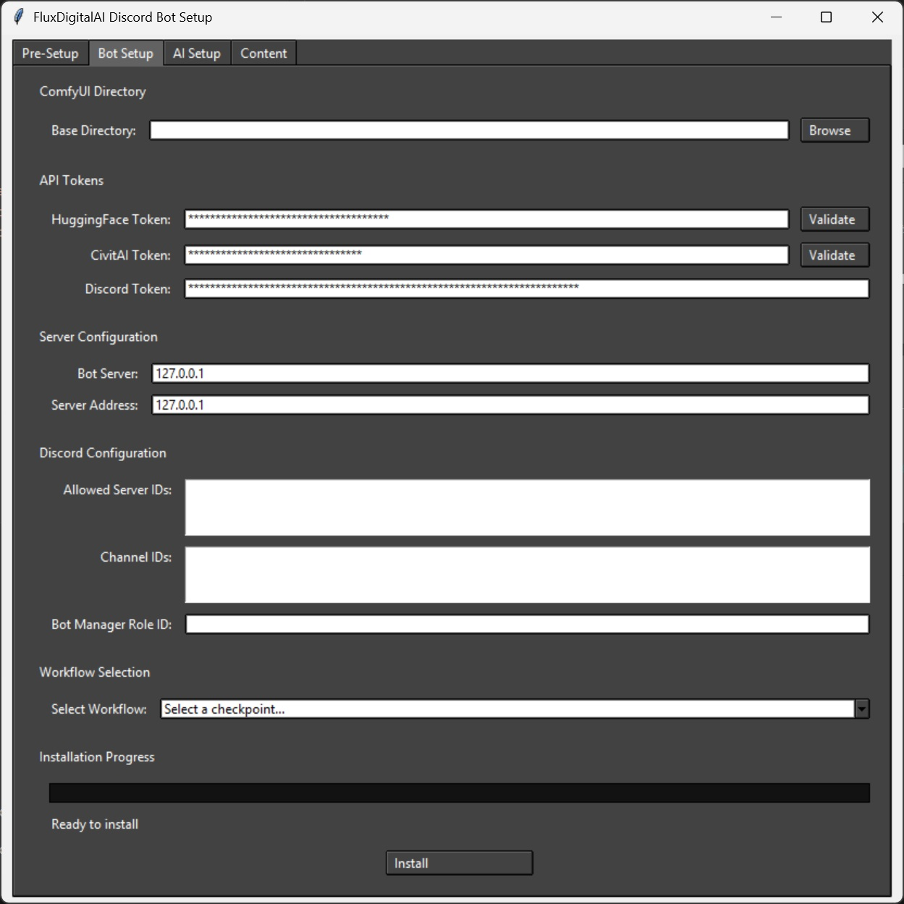
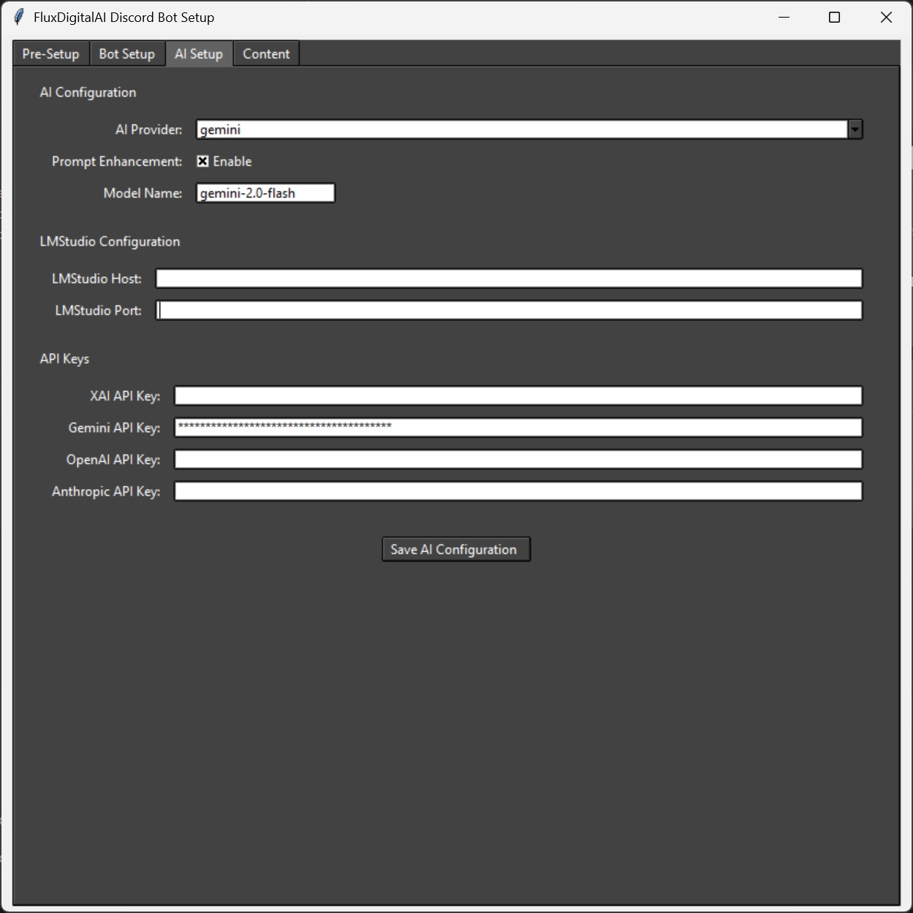
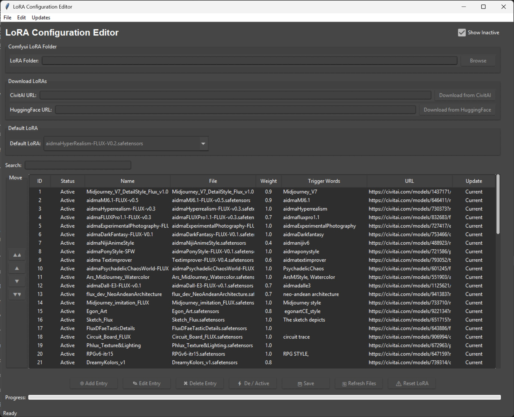

# ⚙️ Configuration Guide

### Prerequisites
- Complete the standard installation and setup first
- Configure your LoRAs using the Lora_editor tool
- Docker and Docker desktop installed on your system


### 🛠️ Bot Configuration

#### Initial Setup


2. Run Setup Tool:
   ```bash
   python setup.py
   ```

<div align="center">
  
  
  
  
</div>

#### 📝 Configuration Details

1. **Path Configuration**
   - Browse to ComfyUI installation location
   - Example: `C:/Comfyui_windows_portable/` or your path

2. **API Tokens**
   - **Civitai Token:**
     1. Create account on [Civitai](https://civitai.com)
     2. Profile → Settings → Add API Key
   
   - **Huggingface Token:**
     1. Create account on [Huggingface](https://huggingface.co)
     2. Profile → Access Tokens
     3. Create token with "read access to public gated repos"

3. **Server Configuration**
   - Bot Server Address: Usually `127.0.0.1` (try `0.0.0.0` or `localhost` if needed)
   - ComfyUI Server: Same as bot (use remote IP if on different machine)

4. **Discord Settings**
   - Server IDs: Right-click server → Copy ID (e.g., `123456789,987654321,654321987`)
   - Channel IDs: Right-click channel → Copy ID (e.g., `123456789,987654321,654321987`)
   - Multiple IDs: Use comma separation (e.g., `123456789,987654321`)
   - BOT_MANAGER_ROLE_ID (optional): For bot administration
     - This role is not required for the bot to work. It's an optional configuration that provides an additional way to grant certain users bot management permissions without giving them full Discord admin rights.    
      If you don't set it, the bot will still function normally - only Discord administrators will be able to use the administrative commands.

5. **Model Selection**
   - Choose checkpoint based on GPU VRAM:
     - Support for 6GB to 32GB cards
     - Select version matching your VRAM capacity


#### ⚠️ Important Notes
- Required files will be automatically moved to their respective folders
- Checkpoint changes: Simply rerun setup tool
- Model changes require bot restart


### Docker Support

- Coming soon


## 🎨 LoRA Models Configuration

### 🌟 Introduction to LoRA Models
LoRA (Low-Rank Adaptation) models are the secret sauce that brings magic to your image generations! These models can:
- Enhance image quality
- Apply specific artistic styles
- Add unique characteristics to generations
- Transform your prompts into stunning visuals

### 📥 Getting LoRA Models manually
1. Visit [Civitai.com/models](https://civitai.com/models)
2. Apply filters:
   - Model Type: `LoRA`
   - Base Model: `Flux.1s` and `Flux.1 D`
3. Download your chosen models
4. Place files in: `comfyui/models/Lora` folder

### 🛠️ LoRA Editor Tool
Navagate to lor_editor folder and run:
```bash
python main.py
```

<div align="center">
  
</div>

#### 🌟 Key Features
- 🔗 URL links support for `/lorainfo` command
- 🚀 Support for 600+ LoRAs
- 💾 SQLite3 database for persistent storage
- 🎯 Persistent trigger words
- 🤗 Civitai support 
- 🤗 Huggingface support
- 🔄 Reset All Loras 
- ⚡ Instant LoRA availability in discord
- 📋 Lora arrangement abilities
- 🔄 check for updates on loras 
- 🎯 Automatic trigger word population
- ⚖️ Pre-configured weights (default: 1.0)
    -if lora weight is less than 1, use lower value
- 📊 Easy weight customization
- 📋 Flexible list organization
    - Sort them in any order you like to display in discord
- 🔗 Activate and Deactivate loras 
    - Have some holiday loras? Activate them for the holidays and deactivate them when done.


### 💡 Best Practices
1. **Weight Management**
   - Default: 1.0
   - Adjust lower for subtle effects
   - Test different values for optimal results

2. **Organization**
   - Use descriptive names
   - Editing the trigger words may result in loras not working
     -if there are multiple trigger words, please edit and only use one.
   - URL is auto populated.
   - do not rename the actual file name, this will result in updates not working

## 🔧 Bot Configuration

### Environment Variables aka .env
All environment variables are auto created when setup is ran

 [🏠  Return to main](../readme.md)